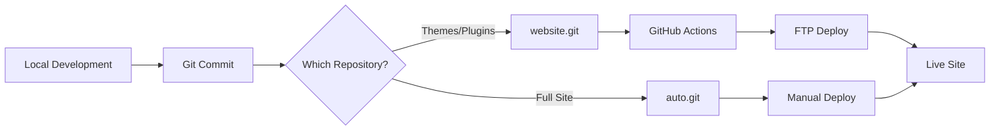

# The Profit Platform - Deployment Strategy

## ✅ Current Setup (Confirmed Working)

You now have **two Git repositories** configured for different purposes:

### 1. `website.git` (Original Repository)
- **URL:** https://github.com/Theprofitplatform/website.git
- **Remote name:** `origin`
- **Purpose:** WordPress theme and plugin development
- **Contents:** `/wp-content/` folder only
- **Deployment:** GitHub Actions FTP to Hostinger
- **Status:** ✅ Connected and working

### 2. `auto.git` (New Repository)
- **URL:** https://github.com/Theprofitplatform/auto.git
- **Remote name:** `auto`
- **Purpose:** Full WordPress site backup/version control
- **Contents:** Everything in `public_html/`
- **Deployment:** Manual or Hostinger Git (if available)
- **Status:** ✅ Connected and tested

## 🚀 How to Use Both Repositories

### For Theme/Plugin Development (Most Common)
```bash
# Make changes to themes or plugins
cd "C:\Users\abhis\Claud and Gemini\The Profit Platform"

# Commit and push to website.git
git add wp-content/
git commit -m "Update theme/plugin"
git push origin master

# GitHub Actions will automatically deploy via FTP
```

### For Full Site Backup
```bash
# After making any changes
git add .
git commit -m "Full site backup"
git push auto master:main

# This creates a version history but doesn't auto-deploy
```

## 📋 Next Steps - Choose Your Deployment Method

### Option A: Continue with GitHub Actions FTP (Recommended) ✅

**What you need to do:**

1. **Add FTP credentials to GitHub Secrets:**
   - Go to: https://github.com/Theprofitplatform/website/settings/secrets/actions
   - Add these secrets:
     - `FTP_SERVER`: Your Hostinger FTP server
     - `FTP_USERNAME`: Your FTP username
     - `FTP_PASSWORD`: Your FTP password
     - `FTP_PORT`: 21 or 990

2. **Test the deployment:**
   ```bash
   # Make a small change
   echo "<!-- Deployment test -->" >> wp-content/themes/kadence-pp-child/footer.php
   git add .
   git commit -m "Test GitHub Actions deployment"
   git push origin master
   ```

3. **Check GitHub Actions:**
   - Visit: https://github.com/Theprofitplatform/website/actions
   - Watch the deployment progress

### Option B: Set Up Hostinger Git Integration

**Check if available in Hostinger:**

1. Log into Hostinger hPanel
2. Look for "Git" or "Git Version Control" in Advanced section
3. If available:
   - Connect to `auto.git` repository
   - Set deployment path to `/public_html`
   - Enable auto-deploy on push

### Option C: Manual Deployment (Backup Plan)

**When needed:**
```bash
# Push to auto.git for version control
git push auto master:main

# Then manually upload via:
# - Hostinger File Manager
# - FTP client (FileZilla)
# - SSH if available
```

## 🔄 Current Workflow Summary



## ✅ What's Working Right Now

1. ✅ Both repositories are connected
2. ✅ You can push to either repository
3. ✅ GitHub Actions workflow is configured
4. ⏳ Waiting for: FTP credentials in GitHub Secrets

## 🎯 Immediate Action Required

**To enable automatic deployment:**

1. Get your FTP credentials from Hostinger:
   - Login to Hostinger hPanel
   - Go to File Manager → FTP Access
   - Copy the credentials

2. Add them to GitHub:
   - Visit: https://github.com/Theprofitplatform/website/settings/secrets/actions
   - Click "New repository secret"
   - Add each credential

3. Test deployment:
   ```bash
   git push origin master
   ```

Once you add the FTP credentials, your automated deployment will start working immediately!

## 📝 Quick Commands Reference

```bash
# Check which remotes you have
git remote -v

# Push theme/plugin changes (auto-deploys)
git push origin master

# Push full site backup (no auto-deploy)
git push auto master:main

# Push to both repositories
git push origin master && git push auto master:main
```

## 🛟 Troubleshooting

If deployment fails:
1. Check GitHub Actions logs
2. Verify FTP credentials are correct
3. Ensure FTP port is correct (21 or 990)
4. Check Hostinger firewall settings

Need help? Check the logs at:
https://github.com/Theprofitplatform/website/actions